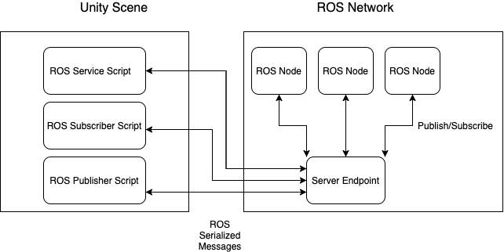

# Bachelor's Degree Thesis: Control of Electromechanical Devices using BCI. Unity Project

## Design
I'm using the [Unity-Robotics-Hub][1], which is a Unity package that manages ROS connections according to this scheme.

[1]: https://github.com/Unity-Technologies/Unity-Robotics-Hub/ "Unity-Robotics-Hub"



## Setup
### Server Endpoint
I have a colcon workspace where I start the server endpoint. To do this, I run the following command, replacing "<your IP address>" with the IP address or hostname of your ROS machine:
```bash
ros2 run ros_tcp_endpoint default_server_endpoint --ros-args -p ROS_IP:=<your IP address>
```

On Linux, you can find out your IP address with the command "hostname -I".

### Start the Echo monitor
To verify that messages are actually being received by ROS, let's run the "rostopic echo" command:
```bash
source install/setup.bash
ros2 topic echo dir_goal
```


